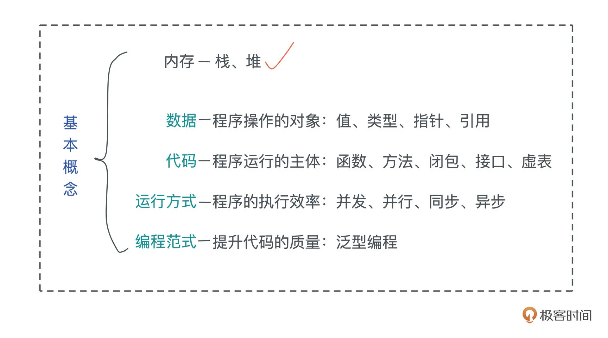
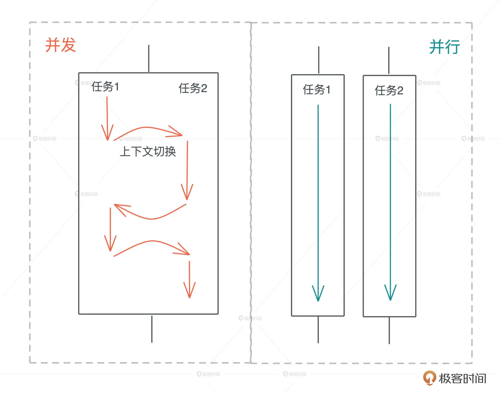
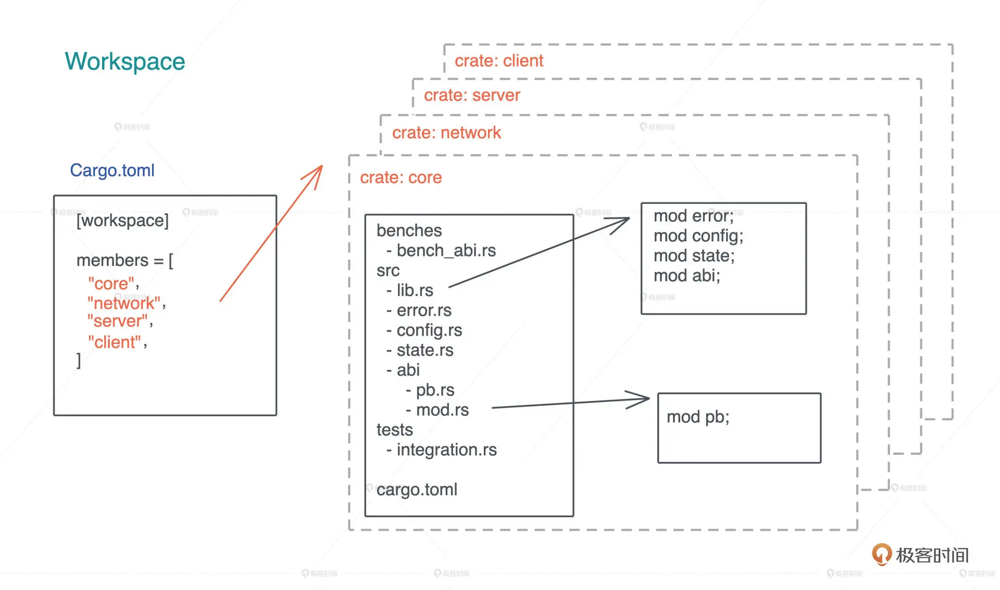
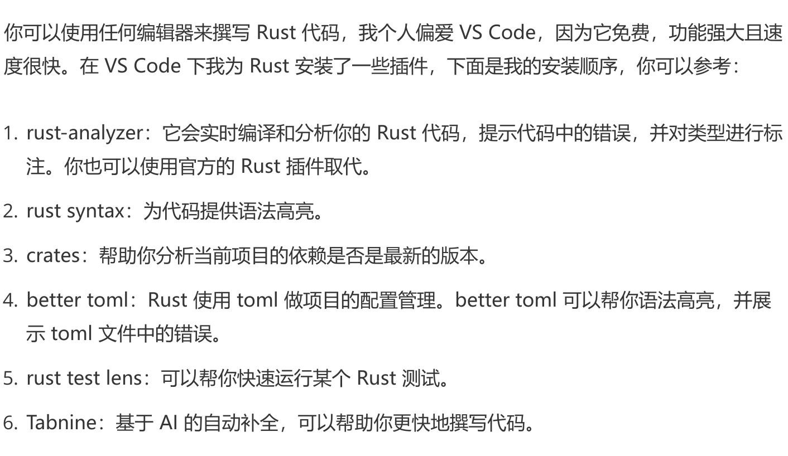

# rust-in-action

## 基本概念

### 内存 —— 堆、栈

在编译时，一切无法确定大小或者大小可以改变的数据，都无法**安全地**放在栈上，**最好**放在堆上。
> 对于存于栈上的值，它的大小在编译期就需要确定。栈上存储的变量的生命周期在当前调用栈的作用域内，无法跨调用栈引用

> 可变参数的函数是一个很好的例子。对于 Java，可变参数 String... a 是 String[] 的语法糖，它是放在堆上的。在 C 语言里，这个行为是未定义的，它只是定义了你可以通过 var_start / var_end 来获得可变参数的起始位置，以及最终结束可变参数的访问。但 gcc 的实现将可变参数放在栈上（估计是为了性能）。比如 C，你可以用 var_start / var_end 获取可变参数，但如果不小心处理， 会导致访问栈上的垃圾内容，甚至导致程序崩溃。@see:https://time.geekbang.org/discuss/detail/307626

除了动态大小的内存需要被分配到堆上外，动态生命周期的内存也需要分配到堆上。
> 堆可以存入大小未知或者动态伸缩的数据类型。堆上存储的变量，其生命周期从分配后开始，一直到释放时才结束，因此堆上的变量允许在多个调用栈之间引用

> ps: 栈上存放的数据是静态的，固定大小，固定生命周期(即使可以支持动态分配，其大小是受限的，受栈帧大小限制，Linux默认8M，同时生命周期也是固定的，比如c99中支持栈上动态分配)；堆上存放的数据是动态的，不固定大小，不固定生命周期

#### 堆问题

- 堆内存忘记释放，内存泄漏
- 属于共享内存区域，当多线程访问时可能出现堆越界（heap out of bounds）问题（写和读）
- 如果堆上内存被释放，但栈上指向堆上内存的相应指针没有被清空，就有可能发生使用已释放内存（use after free）的情况

### 数据

值和类型、指针和引用

#### 值和类型

严谨地说，类型是对值的区分，它包含了值在内存中的长度、对齐以及值可以进行的操作等信息。一个值是符合一个特定类型的数据的某个实体。比如 64u8，它是 u8 类型，对应一个字节大小、取值范围在 0～255 的某个整数实体，这个实体是 64。

这里你要注意，值是无法脱离具体的类型讨论的。同样是内存中的一个字节 0x40，如果其类型是 ASCII char，那么其含义就不是 64，而是 @ 符号。

#### 指针和引用

在内存中，一个值被存储到内存中的某个位置，这个位置对应一个内存地址。而指针是一个持有内存地址的值，可以通过解引用（dereference）来访问它指向的内存地址，理论上可以解引用到任意数据类型。

引用（reference）和指针非常类似，不同的是，引用的解引用访问是受限的，它只能解引用到它引用数据的类型，不能用作它用。比如，指向 42u8 这个值的一个引用，它解引用的时候只能使用 u8 数据类型。

> 指针和引用是原生类型，它们可以分配在栈上。
> 指针和引用都指向值的内存地址，只不过二者在解引用时的行为不一样。引用只能解引用到原来的数据类型，而指针没有这个限制

### 代码

函数、方法、闭包、接口和虚表

函数是编程语言的基本要素，它是对完成某个功能的一组相关语句和表达式的封装。函数也是对代码中重复行为的抽象。

在面向对象的编程语言中，在类或者对象中定义的函数，被称为方法（method）。

而闭包是将函数，或者说代码和其环境一起存储的一种数据结构。闭包引用的上下文中的自由变量，会被捕获到闭包的结构中，成为闭包类型的一部分。

> 函数是代码中重复行为的抽象，方法是对象内部定义的函数，而闭包是一种特殊的函数

---

接口是一个软件系统开发的核心部分，它反映了系统的设计者对系统的抽象理解。作为一个抽象层，接口将使用方和实现方隔离开来，使两者不直接有依赖关系，大大提高了复用性和扩展性。

当我们在运行期使用接口来引用具体类型的时候，代码就具备了运行时多态的能力。但是，在运行时，一旦使用了关于接口的引用，变量原本的类型被抹去，我们无法单纯从一个指针分析出这个引用具备什么样的能力。
因此，在生成这个引用的时候，我们需要构建胖指针，除了指向数据本身外，还需要指向一张涵盖了这个接口所支持方法的列表。这个列表，就是我们熟知的虚表（virtual table）。

当使用接口去引用具体的类型时，我们就需要虚表来辅助运行时代码的执行。有了虚表，我们可以很方便地进行动态分派，它是运行时多态的基础。

### 运行方式

并发并行、同步异步和Promise|async|await

#### 并发（concurrency）与并行（parallel）

并发是一种能力，而并行是一种手段。当我们的系统拥有了并发的能力后，代码如果跑在多个 CPU core 上，就可以并行运行。所以我们平时都谈论高并发处理，而不会说高并行处理。

#### 同步和异步

同步是指一个任务开始执行后，后续的操作会阻塞，直到这个任务结束。在软件中，我们大部分的代码都是同步操作，比如 CPU，只有流水线中的前一条指令执行完成，才会执行下一条指令。一个函数 A 先后调用函数 B 和 C，也会执行完 B 之后才执行 C。

> 同步执行保证了代码的因果关系（causality），是程序正确性的保证。

异步是指一个任务开始执行后，与它没有因果关系的其它任务可以正常执行，不必等待前一个任务结束。

### 编程范式之泛型编程

泛型编程包含两个层面，数据结构的泛型和使用泛型结构代码的泛型化。

#### 数据结构的泛型

它也往往被称为参数化类型或者参数多态

你可以把参数化数据结构理解成一个产生类型的函数，在“调用”时，它接受若干个使用了具体类型的参数，返回携带这些类型的类型。

#### 代码的泛型化

泛型编程的另一个层面是使用泛型结构后代码的泛型化。当我们使用泛型结构编写代码时，相关的代码也需要额外的抽象。

## Rust 基础概念

### 基本语法和基础数据类型

#### 变量和函数

- Rust 支持类型推导，在编译器能够推导类型的情况下，变量类型一般可以省略，但常量（const）和静态变量（static）必须声明类型。
- 定义变量的时候，根据需要，你可以添加 mut 关键字让变量具备可变性。默认变量不可变是一个很重要的特性，它符合最小权限原则（Principle of Least Privilege）。
- 在 Rust 下，函数是一等公民，可以作为参数或者返回值。

- Rust 函数参数的类型和返回值的类型都必须显式定义，如果没有返回值可以省略，返回 unit。
- 函数内部如果提前返回，需要用 return 关键字，否则最后一个表达式就是其返回值。如果最后一个表达式后添加了; 分号，隐含其返回值为 unit。

### 模式匹配

Rust 的模式匹配是一个很重要的语言特性，被广泛应用在状态机处理、消息处理和错误处理中，如果你之前使用的语言是 C / Java / Python / JavaScript ，没有强大的模式匹配支持，要好好练习这一块。

### 错误处理

Rust 没有沿用 C++/Java 等诸多前辈使用的异常处理方式，而是借鉴 Haskell，**把错误封装在 Result 类型中，同时提供了 ? 操作符来传播错误**，方便开发。Result 类型是一个泛型数据结构，T 代表成功执行返回的结果类型，E 代表错误类型。

> Rust 的模式匹配是一个很重要的语言特性，被广泛应用在状态机处理、消息处理和错误处理中，如果你之前使用的语言是 C / Java / Python / JavaScript ，没有强大的模式匹配支持，要好好练习这一块。

> 感觉很抽象啊

### Rust项目的组织

#### Mod（多模块）

当 Rust 代码规模越来越大时，我们就无法用单一文件承载代码了，需要多个文件甚至多个目录协同工作，这时我们可以用 mod 来组织代码。

> 类似ES中的模块化的感觉

#### Crate（单项目|库）

在 Rust 里，**一个项目也被称为一个 crate**。crate 可以是可执行项目，也可以是一个库，我们可以用 cargo new -- lib 来创建一个库。当 crate 里的代码改变时，这个 crate 需要被重新编译。
在一个 crate 下，除了项目的源代码，单元测试和集成测试的代码也会放在 crate 里。

Rust 的单元测试一般放在和被测代码相同的文件中，使用条件编译 #[cfg(test)] 来确保测试代码只在测试环境下编译。
集成测试一般放在 tests 目录下，和 src 平行。和单元测试不同，集成测试只能测试 crate 下的公开接口，编译时编译成单独的可执行文件。

##### Workspace（多项目）

当代码规模继续增长，把所有代码放在一个 crate 里就不是一个好主意了，因为任何代码的修改都会导致这个 crate 重新编译，这样效率不高。我们可以使用 workspace。

一个 workspace 可以包含一到多个 crates，当代码发生改变时，只有涉及的 crates 才需要重新编译。当我们要构建一个 workspace 时，需要先在某个目录下生成一个如图所示的 Cargo.toml，包含 workspace 里所有的 crates，然后可以 cargo new 生成对应的 crates：

## Rust in Vscode

## 国内镜像

export RUSTUP_DIST_SERVER=https://mirrors.sjtug.sjtu.edu.cn/rust-static
export RUSTUP_UPDATE_ROOT=https://mirrors.sjtug.sjtu.edu.cn/rust-static/rustup

rust国内安装必备环境配置